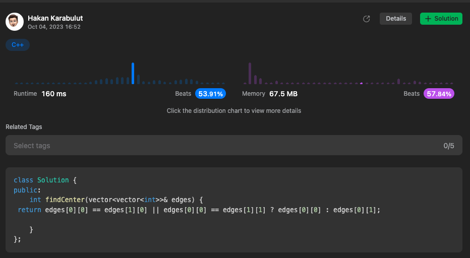

# Intuition
<!-- Describe your first thoughts on how to solve this problem. -->

# Approach
<!-- Describe your approach to solving the problem. -->

# Complexity
- Time complexity:
<!-- Add your time complexity here, e.g. $$O(n)$$ -->

- Space complexity:
<!-- Add your space complexity here, e.g. $$O(n)$$ -->

# Code
```
class Solution {
public:
    int findCenter(vector<vector<int>>& edges) {
 return edges[0][0] == edges[1][0] || edges[0][0] == edges[1][1] ? edges[0][0] : edges[0][1];
  
    }
};
```


# Intuition
<!-- Describe your first thoughts on how to solve this problem. -->

# Approach
<!-- Describe your approach to solving the problem. -->

# Complexity
- Time complexity:
<!-- Add your time complexity here, e.g. $$O(n)$$ -->

- Space complexity:
<!-- Add your space complexity here, e.g. $$O(n)$$ -->

# Code
```
class Solution {
public:
    int findCenter(vector<vector<int>>& edges) {
 return edges[0][0] == edges[1][0] || edges[0][0] == edges[1][1] ? edges[0][0] : edges[0][1];
  
    }
};
```

